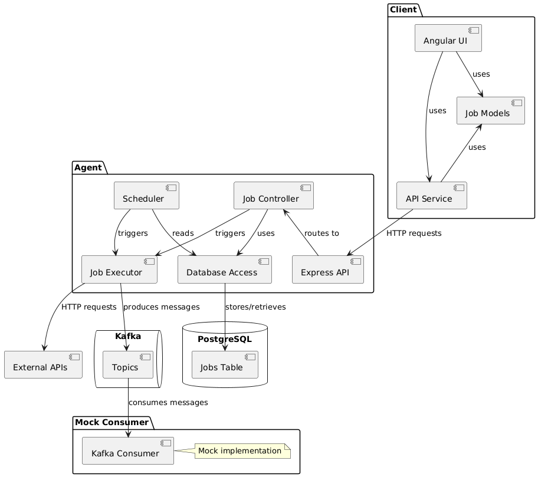
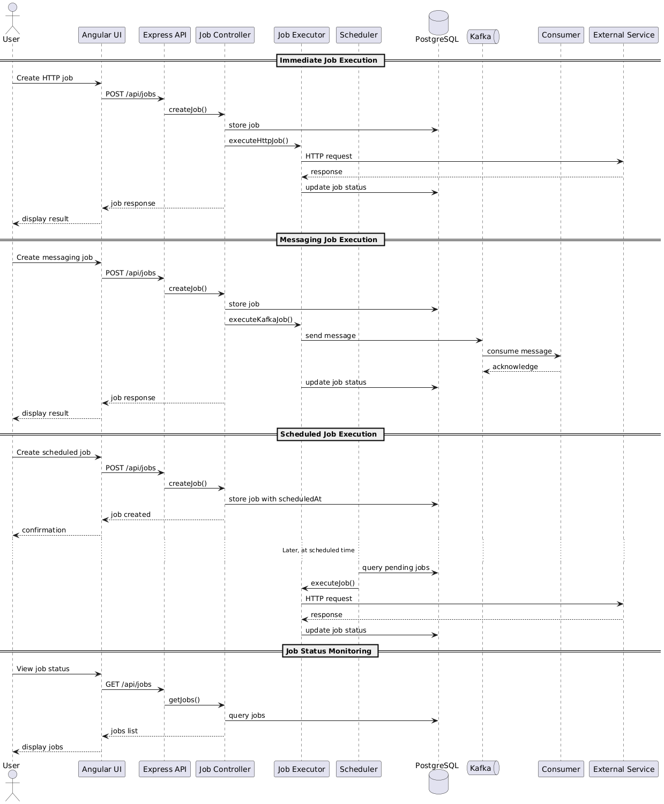
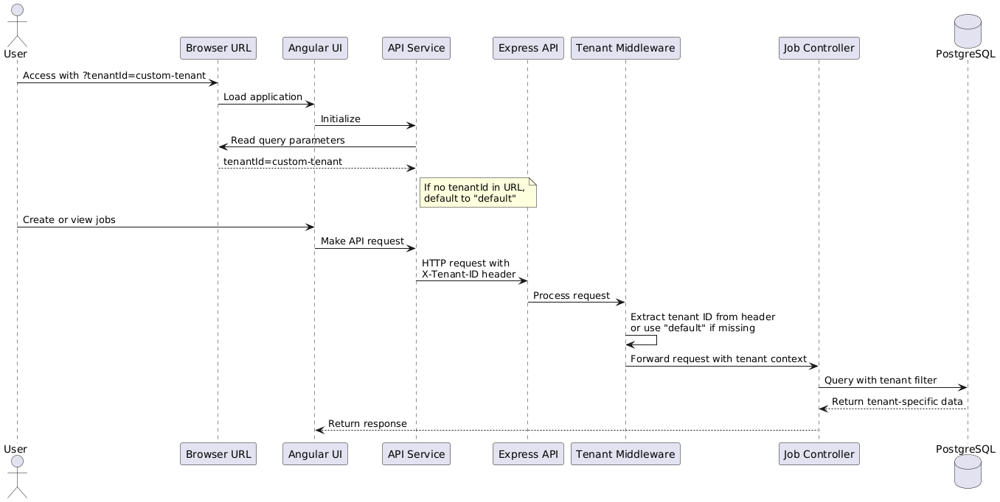
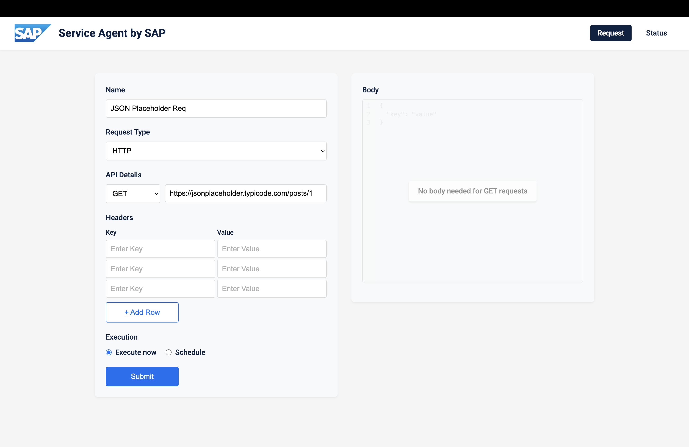
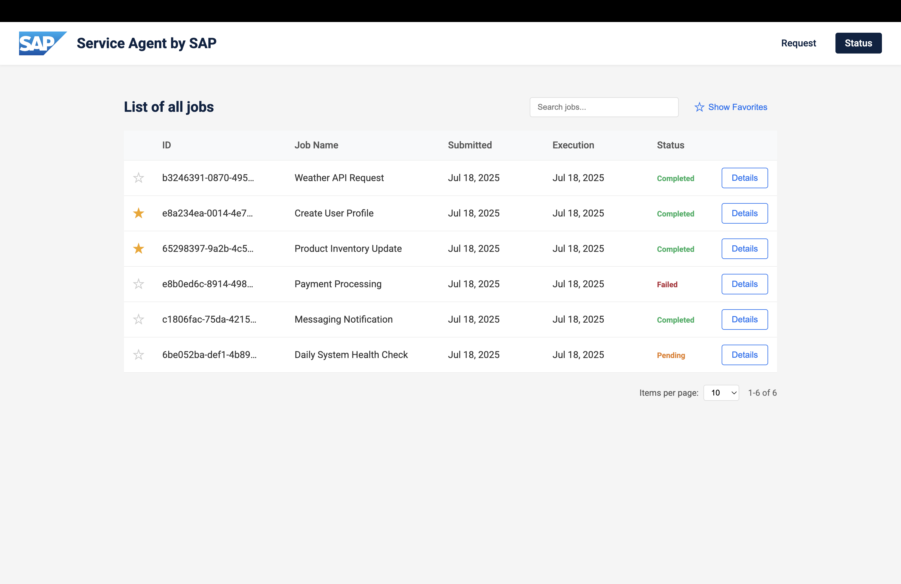

# Service Agent by SAP

> **Note:** The UI implementation is inspired by the provided mockups but includes several enhancements and improvements to the original design while maintaining the core functionality. 😊

A multi-tenant service agent for executing HTTP requests and messaging operations, with support for immediate and scheduled jobs.

## Table of Contents

- [Overview](#overview)
- [Features](#features)
- [Architecture](#architecture)
  - [Logical View](#logical-view)
  - [Process View](#process-view)
- [Database Design](#database-design)
- [Multi-Tenancy](#multi-tenancy)
- [API Reference](#api-reference)
- [Security Considerations](#security-considerations)
- [User Guide](#user-guide)
  - [Creating Jobs](#creating-jobs)
  - [Monitoring Jobs](#monitoring-jobs)
- [Getting Started](#getting-started)
  - [Prerequisites](#prerequisites)
  - [Running the Application](#running-the-application)
  - [Offline Mode with Mocking](#offline-mode-with-mocking)
  - [Mock Consumer for Messaging](#mock-consumer-for-messaging)
  - [Monitoring with Kafka UI](#monitoring-with-kafka-ui)
- [Development](#development)
- [Potential Improvements](#potential-improvements)

## Overview

Service Agent is a platform that enables users to create, schedule, and monitor service requests across different protocols. It supports HTTP requests and messaging operations, with both immediate execution and scheduled jobs.

## Features

- **Multi-tenant architecture**: Securely isolate data between different tenants
- **HTTP job execution**: Make GET, POST, PUT, DELETE requests to external APIs
- **Messaging support**: Send messages to Kafka topics
- **Job scheduling**: Schedule jobs to run at specific times
- **Job monitoring**: Track job status, view responses and errors
- **Responsive UI**: Modern Angular interface for managing jobs
- **Accessibility**: Client interface follows WCAG accessibility guidelines ensuring inclusive user experience

## Architecture

### Logical View

The Logical View illustrates the key components of the Service Agent architecture and their relationships. It shows how the Client (Angular UI) interacts with the Agent backend through the API Service, how the Agent processes jobs and communicates with the database, and how messages flow through Kafka to the Consumer service (which is implemented as a mock).



### Process View

The Process View depicts the sequence of interactions between components for different job execution scenarios. It shows the flow for immediate HTTP job execution, messaging job execution, scheduled job execution, and job status monitoring. This diagram helps understand how data and control flow through the system during various operations.



## Database Design

The Service Agent uses PostgreSQL to store job data with a multi-tenant design. The database schema is optimized for job tracking and execution history.

### Jobs Table

The core table in the database is the `jobs` table, which stores all job-related information:

| Column | Type | Description |
|--------|------|-------------|
| id | UUID | Primary key, automatically generated |
| tenant_id | STRING | Tenant identifier for multi-tenancy support |
| name | STRING | User-provided job name |
| service_type | ENUM | Either 'http' or 'messaging' |
| url | STRING | Target URL for HTTP requests |
| method | STRING | HTTP method (GET, POST, PUT, DELETE) |
| topic | STRING | Kafka topic for messaging jobs |
| headers | JSONB | Request headers stored as JSON |
| body | JSONB | Request body stored as JSON |
| job_type | ENUM | Either 'immediate' or 'scheduled' |
| status | ENUM | Job status (pending, in_progress, completed, failed) |
| scheduled_at | TIMESTAMP | When the job is scheduled to run |
| completed_at | TIMESTAMP | When the job completed execution |
| response | JSONB | Response data stored as JSON |
| error_message | TEXT | Error message if job failed |
| created_at | TIMESTAMP | When the job was created |

### Automatic Seeding

The database is automatically seeded with sample data when the application starts for the first time. The seed data includes:

- Various HTTP requests (GET, POST, PUT) with realistic headers and responses
- A failed payment processing job showing error handling
- A messaging job with Kafka integration
- A scheduled job pending execution

The seeding only occurs if the database is empty (no existing jobs), ensuring that production data is never overwritten.

## Multi-Tenancy

Service Agent implements a robust multi-tenancy model that isolates data between different tenants throughout the entire application stack.

### Tenant Handling Flow

The diagram below illustrates how tenant information flows through the system:



### Client-Side Tenant Management

- **Default Tenant**: The UI uses `default` as the default tenant ID
- **URL Parameter Override**: Users can specify a different tenant by adding `?tenantId=custom-tenant` to the URL
- **Header Propagation**: The Angular API service automatically includes the tenant ID in all API requests via the `X-Tenant-ID` header

### Server-Side Tenant Isolation

- **Middleware Extraction**: A dedicated middleware extracts the tenant ID from the `X-Tenant-ID` header
- **Default Fallback**: If no tenant ID is provided, the system uses `default` as the tenant ID
- **Request Context**: The tenant ID is added to the request object and made available to all controllers
- **Data Filtering**: All database queries automatically filter results by tenant ID, ensuring complete data isolation

### Tenant Usage Examples

1. **Default usage**: 
   - Access `http://localhost:4200`
   - UI uses `default` ID
   - All jobs created and viewed belong to `default`

2. **Custom tenant**:
   - Access `http://localhost:4200?tenantId=customer-a`
   - UI uses `customer-a` ID
   - All jobs created and viewed belong to `customer-a`

## API Reference

### Jobs API

| Endpoint | Method | Description |
|----------|--------|-------------|
| `/api/jobs` | GET | Get all jobs for the tenant with pagination |
| `/api/jobs/:id` | GET | Get a specific job by ID |
| `/api/jobs` | POST | Create a new job |

#### Request Headers

- `X-Tenant-ID`: Required for all requests to identify the tenant or the `default` tenant will be taken

## Security Considerations

The Service Agent implements several security measures:

- **Tenant Isolation**: All data is isolated by tenant ID
- **Input Validation**: Comprehensive validation of all inputs
- **Rate Limiting**: Protection against brute force and DoS attacks
- **Security Headers**: Helmet.js for HTTP security headers
- **CORS Protection**: Restricted cross-origin resource sharing
- **Error Handling**: Secure error handling in the middleware that doesn't leak sensitive information

## User Guide

### Creating Jobs

1. Navigate to the "Request" page
2. Select the job type (HTTP or Messaging)
3. For HTTP jobs:
   - Enter the URL and select the HTTP method
   - Add any required headers
   - Add a request body for POST/PUT requests
4. For Messaging jobs:
   - Enter the topic name
   - Add any required headers
   - Enter the message body
5. Choose execution type (immediate or scheduled)
6. For scheduled jobs, select the date and time
7. Click "Submit" to create the job



### Monitoring Jobs

1. Navigate to the "Status" page
2. View all jobs with their current status
3. Use the search box to filter jobs
4. Click "Details" to view job details including:
   - Request information
   - Response data
   - Headers
   - Error messages (if any)
5. Star important jobs to add them to favorites

The Status page automatically polls the backend every 60 seconds to fetch the latest job statuses, ensuring you always see up-to-date information without manual refreshing.



## Getting Started

### Prerequisites

- Node.js >24 (for running locally)
- Docker and Docker Compose

### Running the Application

#### Using Docker Compose (Recommended)

1. Start all services:
   ```bash
   docker-compose up -d
   ```

2. Access the application at http://localhost:4200

#### Manual Startup of a Specific Component

1. Start all services:
   ```bash
   docker-compose up -d
   ```

2. Stop a specific service (for ex. via Docker Desktop)

3. Adjust ENV variables in `docker-compose.yaml` if needed

4. Start the agent or the client:
   ```bash
   cd agent
   npm run build
   npm start
   ```

   ```bash
   cd client
   npm start
   ```

6. Access the application at http://localhost:4200

### Offline Mode with Mocking

The Service Agent supports an offline mode that mocks all external HTTP requests, allowing the application to function without internet connectivity or external services.

- **Enable Mocking**: Set `USE_MOCK=true` in the agent environment variables in `docker-compose.yaml`

### Mock Consumer for Messaging

The Service Agent includes a mock consumer service that simulates the behavior of a real Kafka consumer. This allows for end-to-end testing of messaging workflows without requiring integration with actual downstream systems.

- **Implementation**: The consumer service is a separate container (`agent-consumer`) in the Docker Compose setup
- **Functionality**:
  - Automatically consumes messages from Kafka topics
  - Processes messages based on their content and headers
  - Logs message details for debugging purposes
  - Dynamically discovers and subscribes to new topics every 30 seconds
  - Uses tenant-namespaced topic format (`tenant.topic-name`)

The dynamic topic discovery feature allows the consumer to automatically detect and subscribe to new topics as they're created, without requiring a restart. This is particularly useful when working with multi-tenant applications where new topics might be created at runtime.

### Monitoring with Kafka UI

The Service Agent includes a Kafka UI for monitoring and managing Kafka topics and messages.

- **Access**: Once the application is running, access Kafka UI at http://localhost:8080

Kafka UI is particularly useful for debugging messaging jobs, verifying that messages are correctly produced by the Agent and consumed by the Consumer service.

## Development

### Project Structure

```
service-agent-by-sap/
├── agent/                 # Backend service
│   ├── src/
│   │   ├── controllers/   # API controllers
│   │   ├── db/            # Database models and connection
│   │   ├── helpers/       # Utility functions
│   │   ├── middleware/    # Express middleware
│   │   ├── mocks/         # Mock implementations for offline mode
│   │   ├── services/      # Business logic
│   │   ├── index.ts       # Application entry point
│   │   └── routes.ts      # API routes
│   └── tests/             # Test files
├── client/                # Frontend Angular application
│   ├── src/
│   │   ├── app/
│   │   │   ├── request/   # Job creation component
│   │   │   ├── status/    # Job monitoring component
│   │   │   └── shared/    # Shared services and models
│   │   ├── assets/        # Static assets
│   │   └── environments/  # Environment configuration
│   └── angular.json       # Angular configuration
└── docker-compose.yml     # Docker Compose configuration
```

### Running Tests

```bash
# Run agent tests
cd agent
npm test

# Run client tests
cd client
npm test
```

### Linting

```bash
# Lint agent code
cd agent
npm run lint

# Lint client code
cd client
npm run lint
```

## Potential Improvements

- **Enhanced Form Validation**: Implement more sophisticated form validation using Angular's Reactive Forms for better error handling and user feedback
- **Component Modularization**: Refactor the Angular components into smaller, more focused components to improve maintainability and reusability
- **Process Management**: Implement PM2 for the Node.js agent to enable process monitoring, automatic restarts, and clustering
- **Environment Configuration**: Enhance environment-specific configuration to better support different deployment scenarios (development, testing, production) and avoid hardcoding